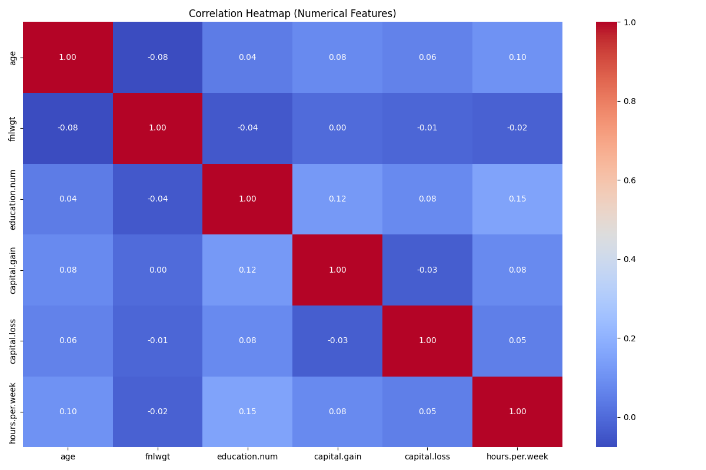
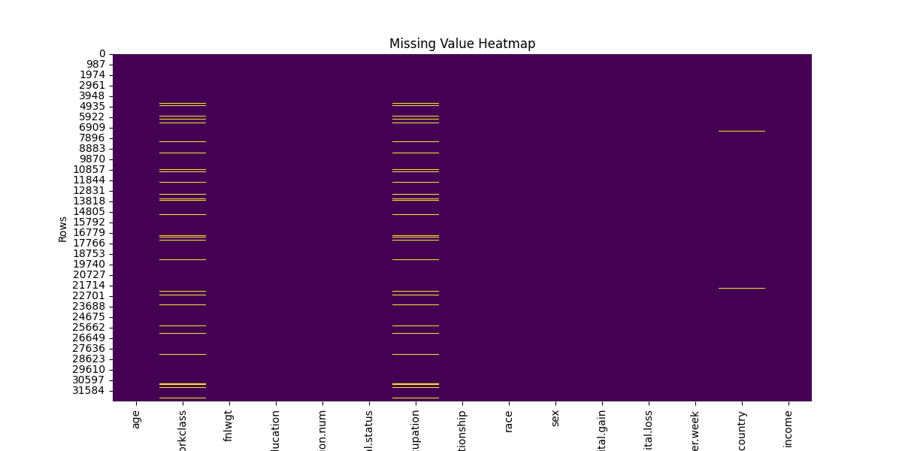

# Data Cleaning Project
## Objective

The primary goal of this project is to explore, clean, and preprocess raw data by handling issues such as:
- Missing values
- Duplicates
- Inconsistent formatting
- Outliers
- Data type mismatches

By the end of this project, the data is cleaned and ready for downstream tasks like visualization, modeling, or statistical analysis.

---

## Dataset

The dataset used for this project is located inside `dataset.zip` and was extracted before processing. The data was loaded using `pandas` and cleaned as per the quality issues observed during exploration.

---

## Notebook: `data_cleaning.ipynb`

The Jupyter notebook contains:
- Dataset loading and initial inspection
- Summary statistics and data types
- Visualizations for missing values, outliers, and distributions
- Cleaning steps with proper explanations and reasoning
- Final dataset shape and confirmation of clean data

### Visualizations Used:
- Histograms for distribution analysis
- Box plots for outlier detection
- Bar plots for categorical feature exploration
- Heatmaps for correlation analysis
- Missing value heatmap

#### Inferences drawn from graphs

These box plots reveal interesting patterns in capital gains and losses across income groups. When examining capital losses, both income brackets (≤$50K and >$50K) display remarkably similar distributions, with most individuals experiencing losses between $500-$2,500 and occasional outliers reaching approximately $4,000, suggesting income level doesn't significantly impact vulnerability to capital losses. However, the capital gains data tells a different story. While most individuals across both income groups show minimal capital gains near zero, the higher income bracket (>$50K) demonstrates greater potential for substantial gains, featuring more frequent moderate gains ($5,000-$20,000) and a notable outlier approaching $100,000. This asymmetry indicates that while financial downside risks appear democratically distributed across income levels, the opportunity for significant investment returns appears to favor those with higher incomes.

"Age-wise, income peaks during middle age—typically between 30 to 55 years. Younger workers are often in early-career, lower-paying roles, while older workers may reduce hours or shift to retirement."

"There’s a clear correlation between higher education and higher income. Those with Bachelor’s degrees or above are far more likely to earn over $50K, emphasizing the long-term financial returns of investing in education."

"Income distribution varies across employment types. Self-employed and federal employees show a stronger presence in the higher-income bracket, while private sector workers mostly earn under $50K. This could point to greater job stability or benefits in public and entrepreneurial roles."

"Occupation matters. Executive and managerial roles dominate the over-$50K category, whereas manual labor and service roles are more concentrated under $50K. This reflects the value placed on leadership, decision-making, and specialized skills in the labor market."

"Not surprisingly, those who work longer hours tend to earn more. However, this also raises questions about work-life balance, labor intensity, and the diminishing returns of excessive work."

"Let’s now examine the income distribution across genders. From the data, it’s evident that men are more likely to earn over $50K compared to women. A large proportion of women remain in the under $50K category, despite similar participation in the workforce.While some of the gap is explained by job type or time commitment, the persistent nature of this divide points to the need for deeper equity reforms—like equal pay policies, better parental support systems, and leadership development programs for women."

"Analyzing income distribution by race reveals notable disparities in earnings. White and Asian individuals show a higher proportion of incomes above $50K, while Black, Hispanic, and Native populations are more concentrated in the under $50K category.Addressing these disparities requires both policy-level changes and inclusive corporate practices to ensure fair opportunities and economic mobility for all racial groups."

"When comparing by native country, U.S.-born individuals lead in higher income representation. Many other countries show a skew toward lower income, possibly due to differences in access, qualifications, or employment types for immigrants."

"Interestingly, marital status also plays a role. Married individuals, especially those with spouses present, are significantly more represented in the higher income group. This may indicate economic advantages through dual incomes or financial stability."

This bar plot displays the count of different education levels within each marital status group. "HS-grad" and "Some-college" are the most frequent education levels among all marital statuses, especially among "Never-married" and "Married-civ-spouse" groups. Higher education levels like "Bachelors" and "Masters" are more common among married individuals, while lower education levels are more prevalent among those who are divorced, separated, or widowed

The violin plot of age by marital status and gender reveals clear demographic patterns: widowed individuals are generally the oldest, with both men and women in this group showing high median ages. Divorced and separated individuals also tend to be older than average, though not as much as the widowed. In contrast, the never-married group is significantly younger, clustering in the 20s and early 30s, while the married categories (both with spouse present and absent) span a wider age range with medians between those of the never-married and widowed groups. Age distributions between males and females are broadly similar within each marital status, though some subtle differences exist in their spreads and medians.

The violin plot of age by education and gender demonstrates that higher educational attainment is generally associated with older age groups, especially for advanced degrees such as Doctorate and Professional School, reflecting the time investment required to achieve these qualifications. Lower education levels, such as elementary and middle school, show a wider age spread but tend to have younger medians. Across most education categories, age distributions between males and females are quite similar, although certain categories may have slightly older medians for one gender.

"There’s a notable gender gap in hours worked. On average, men work longer hours than women, which partially explains income disparities. However, this also ties into deeper systemic factors like childcare, societal roles, and occupational choices."

The stacked bar plot of race by hours worked per week highlights that the majority of individuals in every work-hour category are White, with the largest group working 41–50 hours per week. Other racial groups, such as Black, Asian-Pacific Islander, American Indian-Eskimo, and Other, are present across all hour categories but in much smaller numbers. This distribution remains consistent regardless of the number of hours worked, indicating that the racial composition of work-hour groups mirrors the overall racial makeup of the dataset.

the grouped bar chart of workclass versus education shows that the private sector employs the largest number of individuals across all education levels, especially for those with a high school diploma, some college, or middle school education. Other workclasses-including state and federal government, local government, and self-employment-have significantly lower counts, and their educational distributions are more evenly spread. This suggests that the private sector is the primary employer for people with diverse educational backgrounds, while public sector and self-employed roles are less common.

This bar plot shows the distribution of education levels across different occupations. "HS-grad" (high school graduates) and "Some-college" are the most common education levels in almost every occupation. Certain occupations like "Exec-managerial" and "Prof-specialty" have higher counts of individuals with "Bachelors" and "Masters" degrees, while manual or service-oriented jobs (e.g., "Handlers-cleaners", "Farming-fishing") are dominated by those with lower education levels. This indicates a clear relationship between education attainment and the type of occupation

This stacked bar plot illustrates the distribution of relationship roles (e.g., Husband, Wife, Own-child) within each marital status category. "Married-civ-spouse" is dominated by the "Husband" and "Wife" categories, while "Never-married" is primarily composed of "Own-child" and "Not-in-family" relationships. The "Divorced", "Separated", and "Widowed" categories have higher proportions of "Unmarried" and "Not-in-family" individuals, reflecting expected social patterns

"Finally, our correlation heatmap confirms that education, hours per week, and age have the strongest positive correlations with income. Meanwhile, factors like gender and marital status also show moderate influence."

The heatmap visualizes missing data across all columns and rows in the dataset. Columns such as "workclass", "occupation", and "country" have visible lines indicating missing values, while other columns are mostly complete. The overall dataset appears to be mostly complete, but some categorical features require attention for missing data imputation or cleaning