# Data Cleaning Project
## Objective

The primary goal of this project is to explore, clean, and preprocess raw data by handling issues such as:
- Missing values
- Duplicates
- Inconsistent formatting
- Outliers
- Data type mismatches

By the end of this project, the data is cleaned and ready for downstream tasks like visualization, modeling, or statistical analysis.

---

## Dataset

The dataset used for this project is located inside `dataset.zip` and was extracted before processing. The data was loaded using `pandas` and cleaned as per the quality issues observed during exploration.

---

## Notebook: `data_cleaning.ipynb`

The Jupyter notebook contains:
- Dataset loading and initial inspection
- Summary statistics and data types
- Visualizations for missing values, outliers, and distributions
- Cleaning steps with proper explanations and reasoning
- Final dataset shape and confirmation of clean data

### Visualizations Used:
- Histograms for distribution analysis
- Box plots for outlier detection
- Bar plots for categorical feature exploration
- Heatmaps for correlation analysis
- Missing value heatmap

#### Inferences drawn from graphs
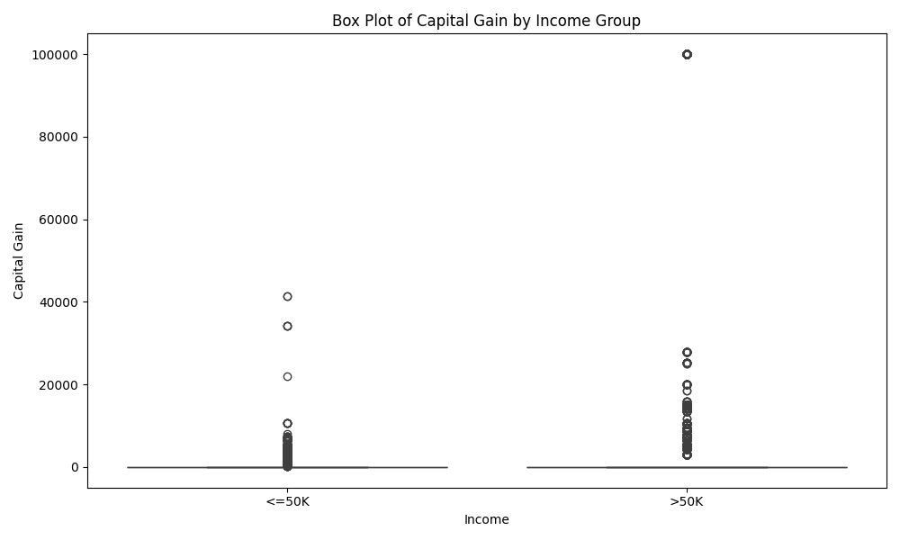
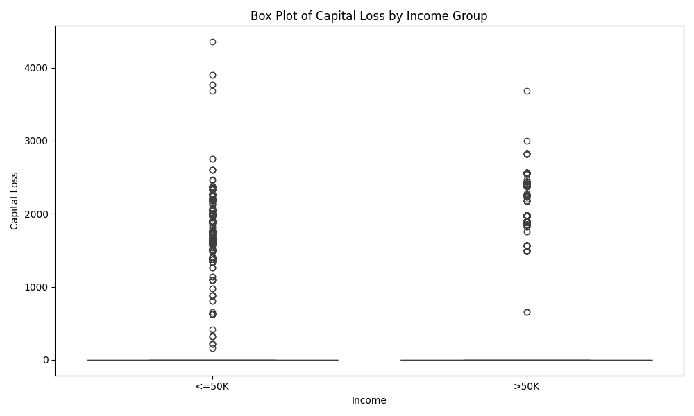
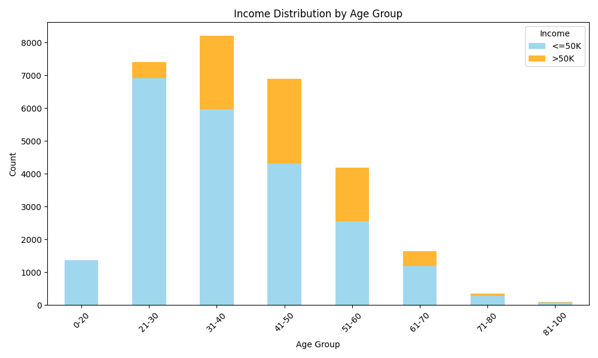
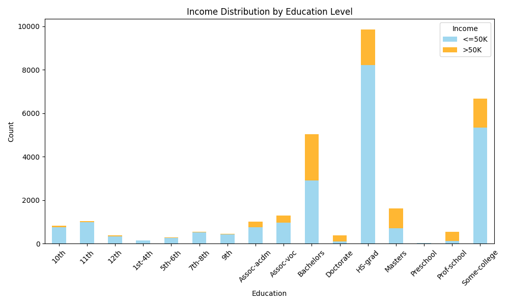
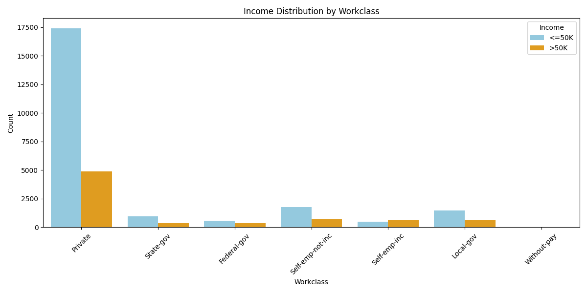
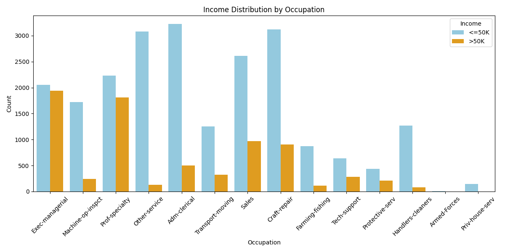
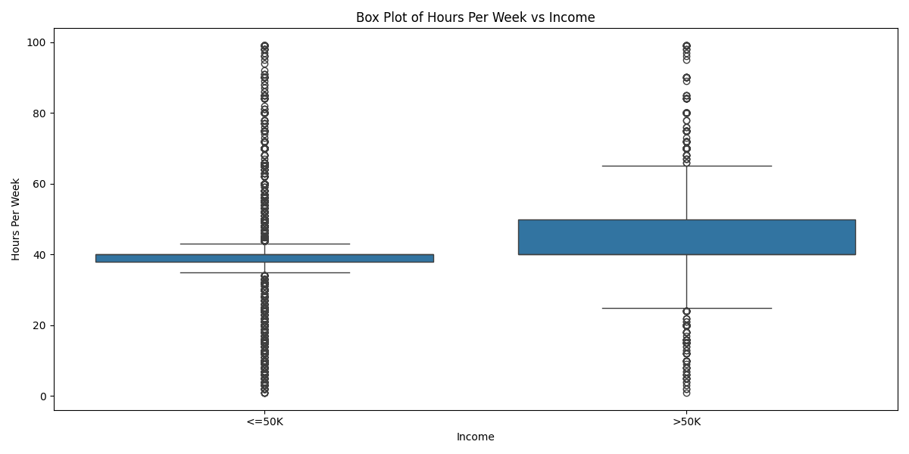
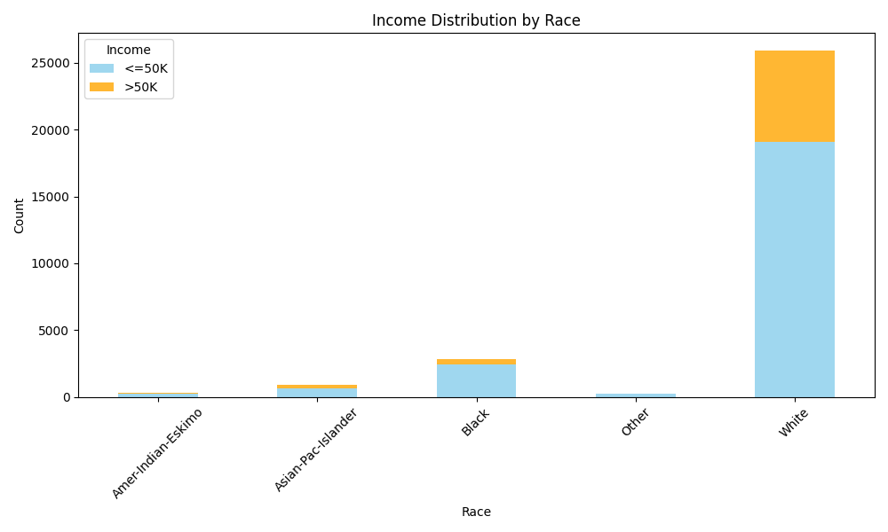

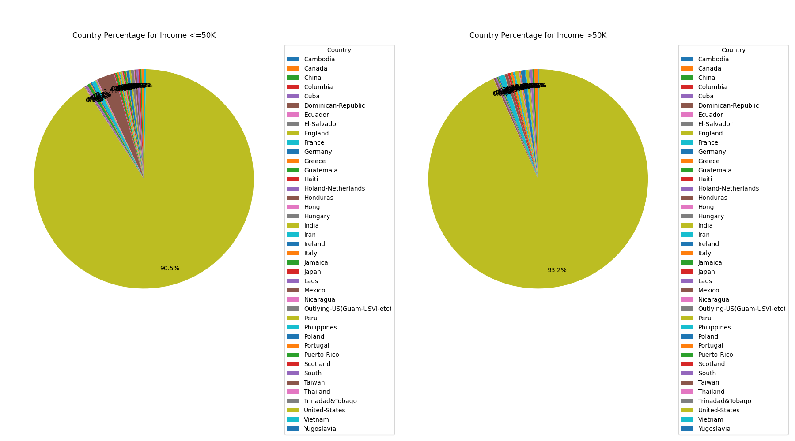
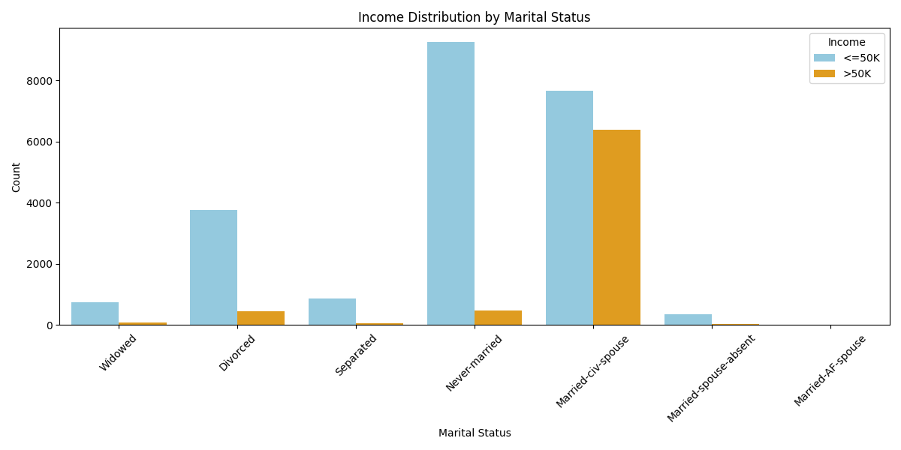
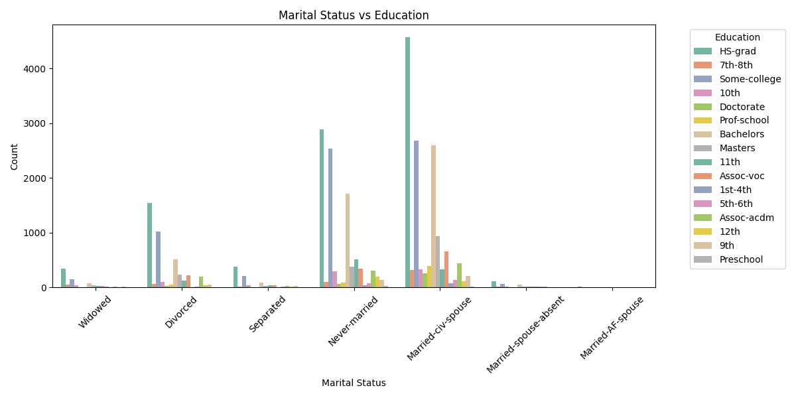
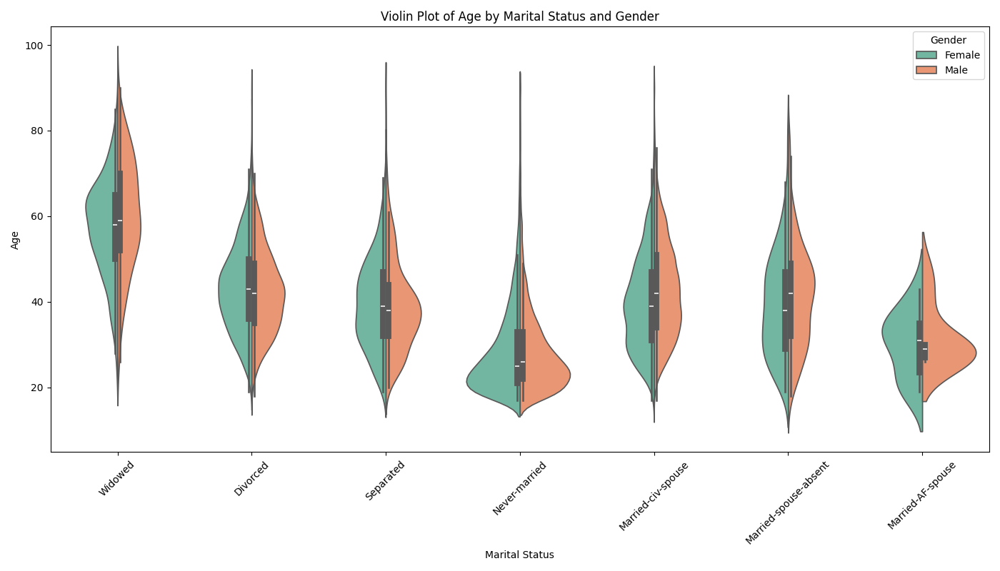
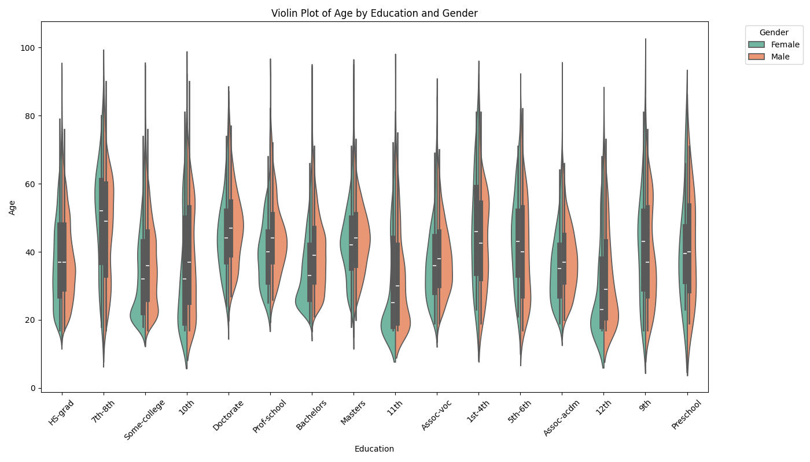
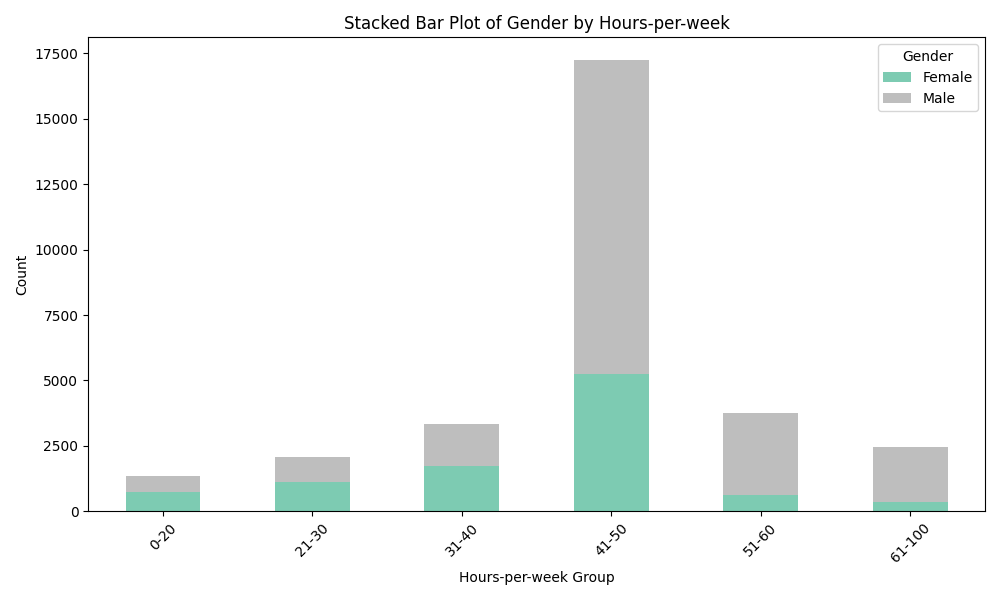
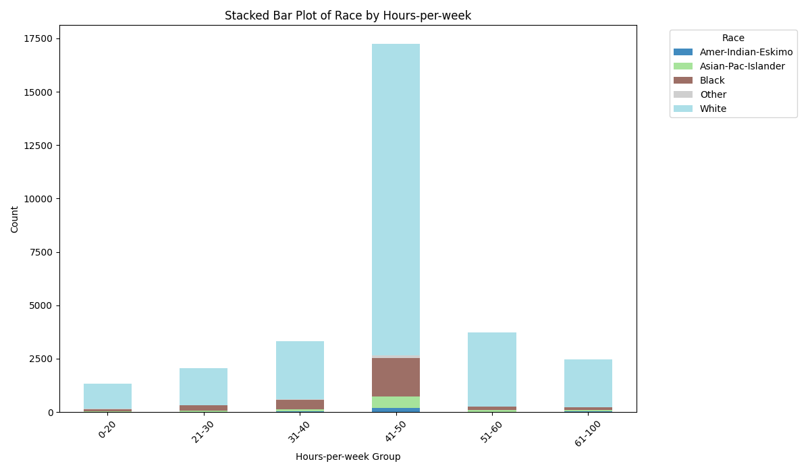
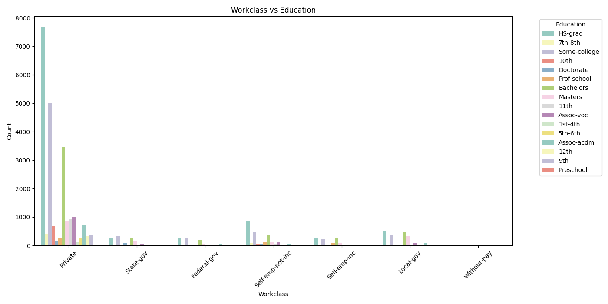
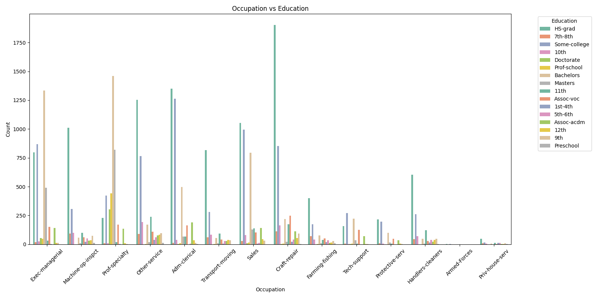
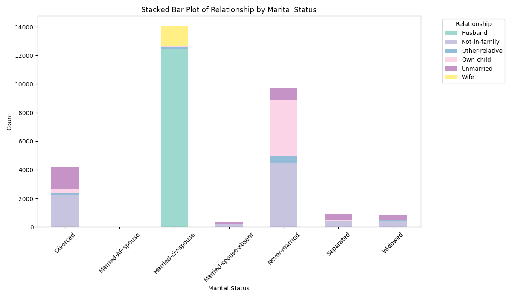