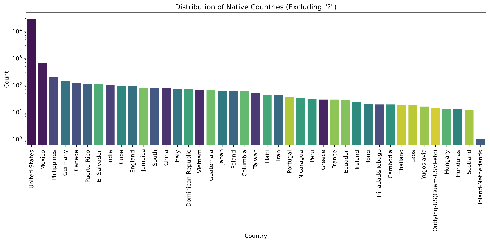
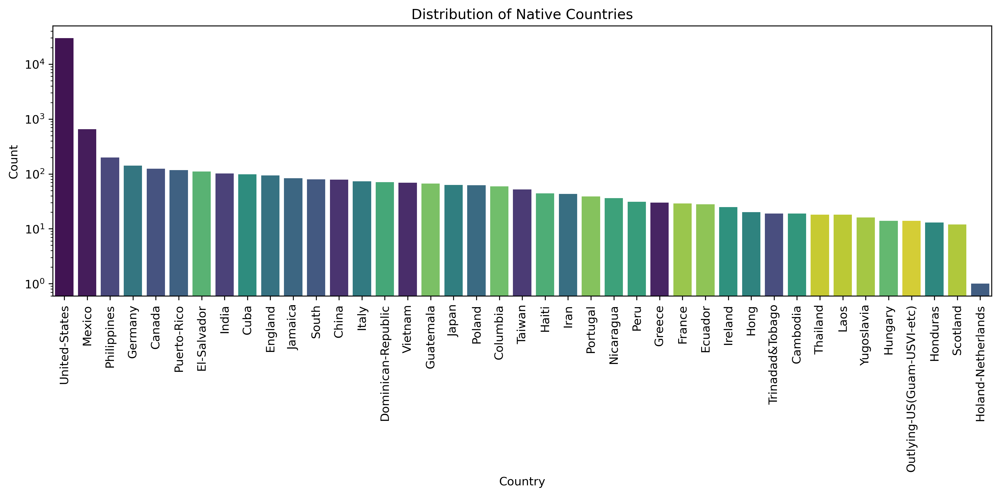
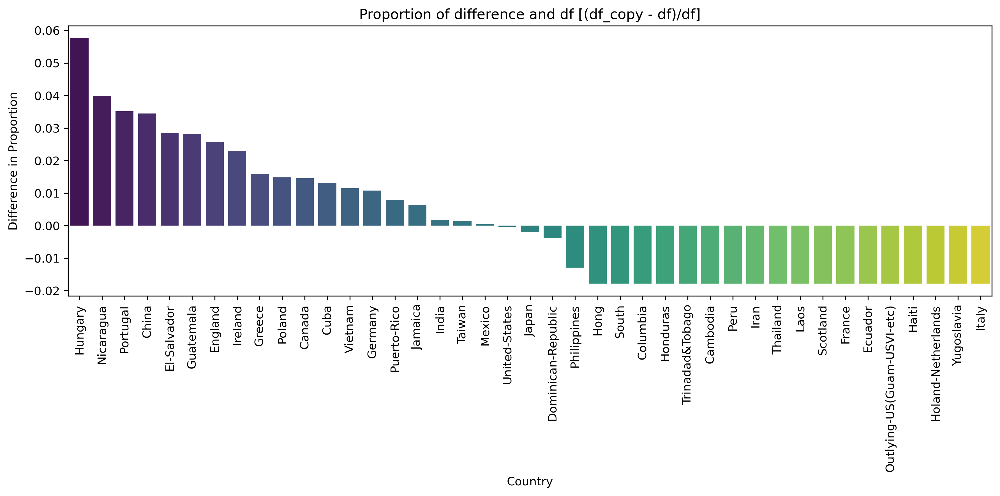
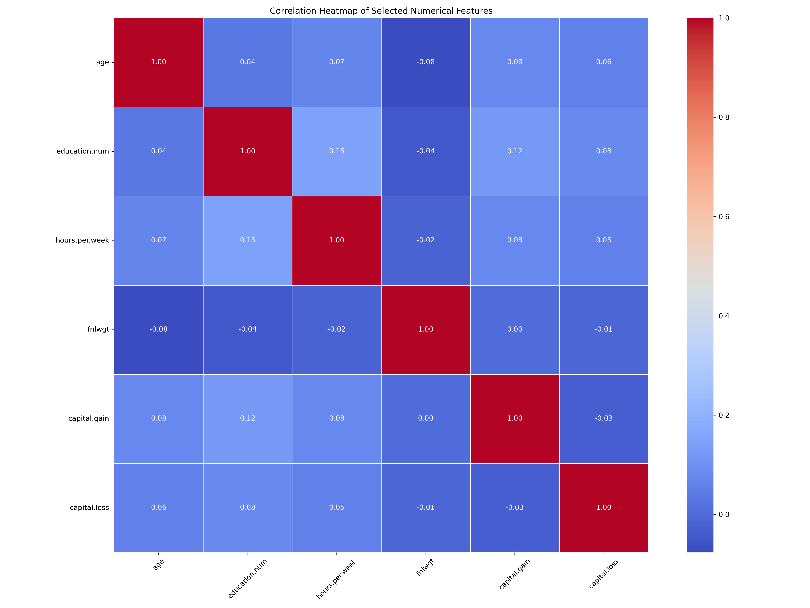
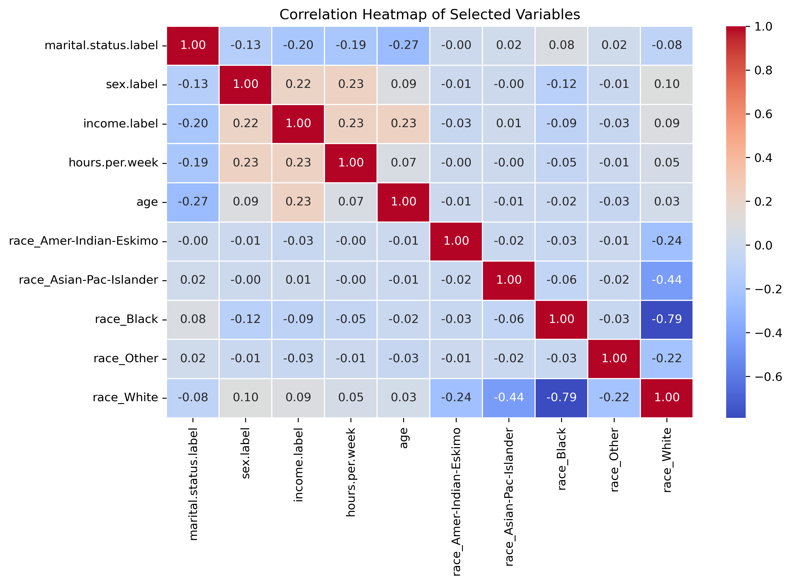
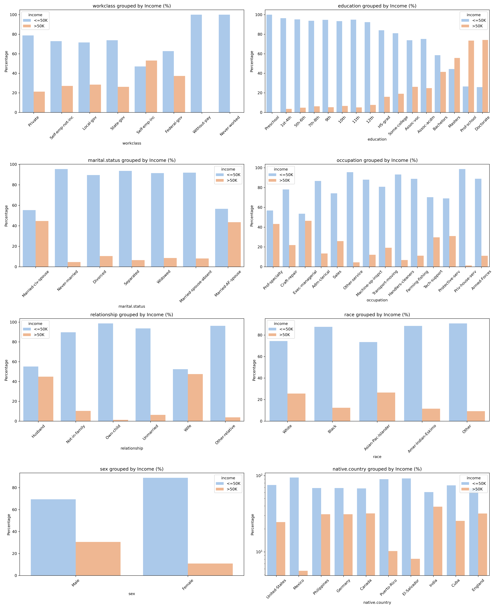
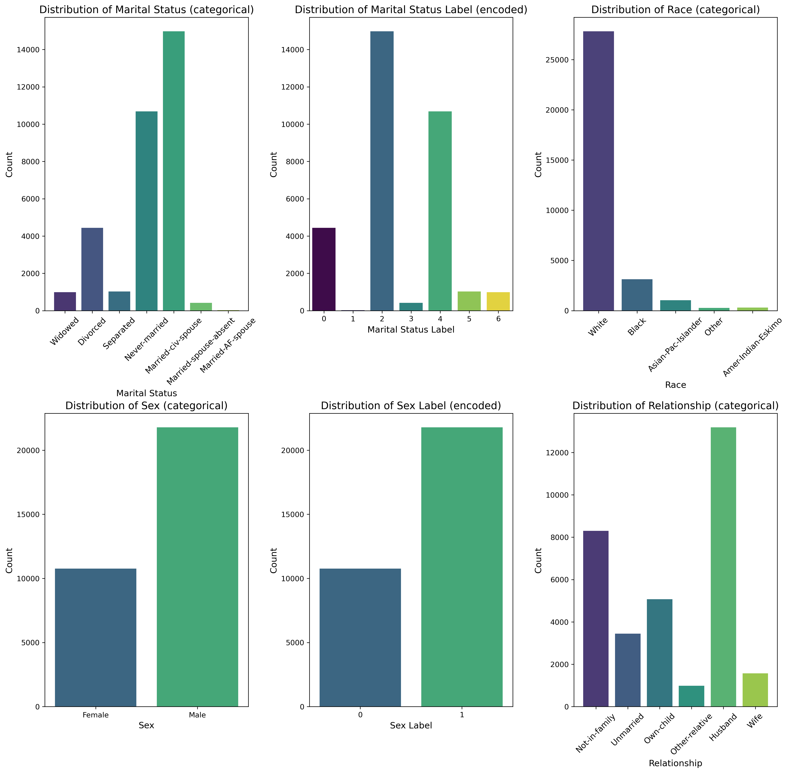

# Data Cleaning and Analysis for Machine Learning

## Overview

This project demonstrates the process of data cleaning and preprocessing using Python for machine learning. The goal is to prepare a dataset for machine learning tasks by applying various data cleaning techniques. The project is built using Python, Pandas, NumPy, MatPlotLib and various data processing libraries. The environment for the project is managed using Conda.

## Project Setup

### Step 1: Clone the repository
Clone the repository by running the following command in your terminal or Git Bash:
```  
cd your_folder  
git clone "https://github.com/Awesome-AI-ML-DELTA25/DataCleaning.git"
```

### Step 2: Install Conda (if not already installed)
Ensure you have installed either anaconda or miniconda.  
Link for installing: [Conda Download](https://www.anaconda.com/download/)

### Step 3: Create and activate the Conda environment

To set up the same virtual environment as used in this project, run the following command:  
` conda env create -f environment.yml `

Activate the environment:  
` conda activate ml_env `

### Step 4: Install required packages
 ` pip install -r /path/to/requirements.txt ` 


## Usage

1. Open the Jupyter notebook file (`data_cleaning.ipynb`) using Jupyter Lab or Jupyter Notebook.  
2. Run the cells sequentially to reproduce the data cleaning, encoding, and analysis steps.  
3. Visualizations and intermediate results will be displayed inline.


## File Structure

- `data/` — raw and processed datasets  
- `data_cleaning.ipynb` — Jupyter notebook with code and visualizations  
- `environment.yml` — Conda environment specification  
- `requirements.txt` — Python packages

## Summary of Jupyter File

### Data Cleaning
Missing values marked as `"?"` in columns like `workclass`, `occupation`, and `native.country` were replaced by sampling from the existing value distributions to maintain overall data balance.  
Outliers in columns such as `age`, `hours.per.week`, and `fnlwgt` were identified but not removed due to insufficient context.

### Encoding
Categorical variables were encoded appropriately: label encoding was applied to binary/ordinal columns (`sex`, `income`, `marital.status`), while one-hot encoding was used for nominal variables like `race` and `relationship` to prepare data for modeling.

### Analysis
Numerical and categorical features were analyzed individually and in relation to each other, exploring correlations like `education.num` vs `capital.gain`, and patterns of `hours.per.week` across `sex`, `occupation`, and `income`. Various plots were used to visualize distributions and relationships to inform preprocessing.

### Relevant Graphs









## Authors
Aditey Nandan  
Hasini G