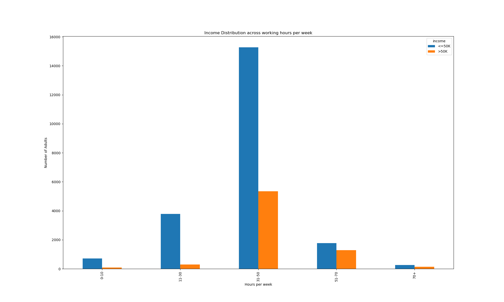

# Data Cleaning and Visualization Project

## Project Overview

This project explores, cleans, and visualizes the Adult Income Dataset (Census Income Dataset), which contains demographic and income information. The primary goal is to prepare the data for further analysis and modeling, and to extract insights about the factors influencing income.

---

## Dataset Description

- **Source**: Extracted from the 1994 Census database by Barry Becker.
- **Prediction Task**: Determine whether a person makes over 50K a year.
- **Features**:
  - `age`: Age of individuals (17–90)
  - `workclass`: Type of employment (e.g., Private, Self-emp, Gov)
  - `fnlwgt`: Final weight (not used for individual analysis)
  - `education`: Highest education level
  - `education-num`: Years of education (1–16)
  - `marital-status`: Marital status
  - `occupation`: Occupation type
  - `relationship`: Family relationship
  - `race`: Race
  - `sex`: Gender
  - `capital-gain`: Capital gains (0–99,999)
  - `capital-loss`: Capital losses (0–4,356)
  - `hours-per-week`: Weekly working hours (1–99)
  - `native-country`: Country of origin
  - `income`: Target variable (`>50K` or `<=50K`)

---

## Data Cleaning Steps

1. **Initial Loading**  
   - Loaded the dataset using pandas.

2. **Dropping Unnecessary Columns**  
   - Dropped `fnlwgt` (not relevant for individual analysis).
   - Dropped `education` (redundant with `education-num`).

3. **Handling Missing Values**  
   - Replaced `'?'` with `pd.NA` for proper null handling.
   - Imputed missing values in `workclass`, `occupation`, and `native.country` with their respective modes.

4. **Capital Gain Outlier Handling**  
   - Replaced `99999` in `capital.gain` with `0`, treating it as a placeholder for missing/invalid data.

5. **Removing Duplicates**  
   - Dropped duplicate rows to ensure data integrity.

---

## Feature Engineering

- **Non-zero Capital Gain/Loss**: Created new columns to indicate non-zero capital gain/loss.
- **Binned Age**: Grouped `age` into bins: `17-30`, `31-50`, `51-70`, `70+`.
- **Binned Hours per Week**: Grouped `hours-per-week` into bins: `0-10`, `11-30`, `31-50`, `51-70`, `70+`.
- **Country Grouping**: Collapsed all countries except `United-States` into `Other`.

---

## Data Visualization and Inferences

### 1. Income vs Age
**Graph**: 
**Inferences**:
- The number of high earners (`>50K`) increases from the youngest group (17–30) and peaks in the 31–50 age group, indicating that income tends to rise with experience and career progression.
- In the 51–70 age group, the number of high earners starts to decline, likely due to retirement or reduced working hours, but this group still maintains a significant proportion of high earners compared to the youngest group.
- The 70+ group has the fewest high earners, suggesting that most individuals in this age range are retired or working part-time, resulting in lower income.

---

### 2. Income vs Workclass
**Graph**: 
**Inferences**:
- Private sector dominates both income groups, but the proportion of high earners is higher in government and self-employed categories.
- "Never-worked" and "Without-pay" classes have almost no high earners.
- Federal and local government jobs have a higher ratio of high earners compared to the private sector.

---

### 3. Income vs Education Number
**Graph**: 
**Inferences**:
- Higher education years correlate strongly with higher income.
- Most low earners have 9–10 years of education, while high earners peak at 13–16 years.
- There are very few high earners with less than 10 years of education.

---

### 4. Income vs Marital Status
**Graph**: 
**Inferences**:
- "Married-civ-spouse" group has the highest number of high earners.
- "Never-married" and "Divorced" groups are dominated by low earners.
- Being married is a strong indicator of higher income.

---

### 5. Income vs Occupation
**Graph**: 
**Inferences**:
- Managerial and professional-specialty occupations have the highest counts of high earners.
- Service and manual labor occupations are dominated by low earners.
- Some occupations (e.g., "Armed-Forces") have very few entries, indicating rarity.

---

### 6. Income vs Race
**Graph**: 
**Inferences**:
- The majority of both income groups are "White," but the proportion of high earners is higher among "White" and "Asian-Pac-Islander."
- Other racial groups have fewer high earners, possibly reflecting broader socioeconomic disparities.
- "Black" and "Amer-Indian-Eskimo" groups are dominated by low earners.

---

### 7. Income vs Sex
**Graph**: 
**Inferences**:
- Males have a significantly higher proportion of high earners compared to females.
- The gender gap in income is evident, with females underrepresented among high earners.
- Both genders have a majority of low earners.

---

### 8. Income vs Capital Gain
**Graph**: 
**Inferences**:
- Most individuals have zero capital gain.
- High capital gains are almost exclusively associated with high earners.
- The distribution is extremely right-skewed, with a few individuals having very high gains.

---

### 9. Income vs Non-zero Capital Gain
**Graph**: 
**Inferences**:
- Among those with non-zero capital gain, high earners are the majority.
- The presence of any capital gain is a strong indicator of higher income.
- Non-zero capital gain is rare in the dataset.

---

### 10. Income vs Capital Loss
**Graph**: 
**Inferences**:
- Most individuals have zero capital loss.
- High capital losses are more common among high earners, but the effect is less pronounced than for capital gain.
- The distribution is right-skewed, with a few large losses.

---

### 11. Income vs Non-zero Capital Loss
**Graph**: 
**Inferences**:
- Non-zero capital loss is more frequent among high earners.
- The presence of capital loss is less predictive of high income than capital gain.
- Most individuals, regardless of income, have no capital loss.

---

### 12. Income vs Hours per Week
**Graph**: 
**Inferences**:
- High earners are concentrated in the `31-50` and `51-70` hour bins.
- Most low earners work `31-50` hours, but the proportion of high earners increases with more hours worked.
- Very few high earners work less than 30 hours per week.

---

### 13. Income vs Native Country
**Graph**: 
**Inferences**:
- The vast majority of both income groups are from the United States.
- High earners are almost exclusively from the United States.
- "Other" countries have very few high earners, indicating possible demographic or economic differences.

---

## Summary of Data Cleaning and Analysis

- **Missing values** were handled using mode imputation for categorical features.
- **Duplicates** were removed to ensure data quality.
- **Feature engineering** included binning and grouping for better visualization and analysis.
- **Visualizations** revealed strong relationships between income and features like education, occupation, marital status, and hours worked.

---

## How to Run

1. Clone the repository.
2. Install dependencies (see `requirements.txt`).
3. Run the Jupyter notebook `data_cleaning.ipynb`.
4. View the generated graphs in the `graphs` directory.