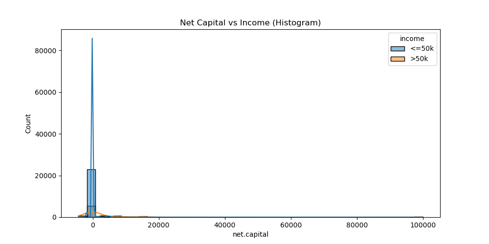

<!-- # To Do
- Create a conda environment to store the packages
- Unzip the data (use !unzip on terminal or use python package zipfile)
- Load the data into a pandas dataframe
- Clean the data (up to your discretion)
- Work solo or in pairs
- Ensure that your code is well commented
- Create a jupyter notebook to document your work
- Create a README file to explain your project, your process, and your findings
- Create a requirements.txt file to document the packages you used
- Create a .gitignore file to ignore the data files
- Create a branch for your project on this repository

The best project will be merged into the main branch for showcase! Good luck! -->

# Data Cleaning and Visualization Project

## Project Overview
This project focuses on exploring, cleaning, and preprocessing a raw dataset to prepare it for further analysis, modeling, or visualization. The dataset contains demographic and income information, including features like age, workclass, education, occupation, capital gains and losses, and more.

The main objectives are:
- Handle missing values and inconsistencies
- Remove duplicates
- Fix data formatting issues
- Detect and handle outliers
- Convert data to correct types
- Generate insightful visualizations to understand patterns in the data

---

## Data Cleaning Process

1. **Handling Missing Values:**
   - Rows with missing or unknown values (`?`) were removed to ensure clean data.
   - For categorical columns like `workclass` and `occupation`, missing values were replaced with 'Unknown' before dropping remaining nulls.
   
2. **Removing Duplicates:**
   - Duplicate rows were identified and dropped to avoid bias.

3. **Standardizing Text Columns:**
   - All categorical text fields were stripped of whitespace and converted to lowercase for consistency.

4. **Converting Data Types:**
   - Numeric columns such as `age`, fnlwgt, `education.num`, `capital.gain`, `capital.loss`, and `hours.per.week` were explicitly converted to numeric types.
   - Rows that became invalid during conversion were dropped.

5. **Feature Engineering:**
   - Created a new column `net.capital` as the difference between `capital.gain` and `capital.loss`.

6. **Exporting Clean Data:**
   - The cleaned dataset was saved as `cleaned_data.csv` for downstream tasks.

---

## Data Visualization

- Various plots were created using Matplotlib and Seaborn to explore relationships and distributions in the data.
- All graphs are saved in the `graphs/` directory.

---

## How to Run

1. Clone the repository.  
2. **Using Conda environment (recommended):**

    ```bash
    conda env create -f environment.yml
    conda activate my_env  # replace my_env with your env name
    python your_script.py  # run your cleaning and visualization scripts

3. Run the cleaning and visualization scripts.  
4. View the output graphs inside the `graphs/` folder.  

---

## Implications and Findings
### Age vs Income

- The median age is higher for the >50k group compared to the <=50k group.
- The interquartile range (IQR), is also higher for the >50k group, indicating that higher earners tend to be older on average.
- There are more outliers (older individuals) in the <=50k group, suggesting that while most high earners are older, some older individuals still earn less.

### Education vs Income

- Higher education levels are associated with higher income brackets.
- The median education level is higher for the >50k group compared to the <=50k group.
- Some education levels (e.g., hs-grad, some-college) have a very large number of entries, while others like preschool, 1st-4th, and doctorate have very few.

### Occupation vs Income

- For every occupation, the number of people earning <=50k (blue bars) is higher than those earning >50k (orange bars).
- Managerial and professional-specialty occupations have the highest counts of high earners (>50k), but even in these categories, low earners (<=50k) outnumber high earners.
- Certain occupations (e.g., handlers-cleaners, machine-op-inspct, farming-fishing, transport-moving, priv-house-serv) have very few high earners (>50k), indicating these roles are predominantly lower-income.
- Some categories, like armed-forces and priv-house-serv, have very low counts overall, which may suggest limited data or rare occupations in the dataset.
- The "unknown" category has a substantial number of entries, which could indicate missing or unclassified occupation data.

### Marital Status vs Income

- Across all marital status categories, the number of people earning <=50k (blue bars) is higher than those earning >50k (orange bars).
- The "married-civ-spouse" group stands out: it has a large number of both low and high earners, but the count of high earners (>50k) is much higher here than in any other group.
- "Never-married" individuals are overwhelmingly low earners, with very few earning >50k.
- Marital status is a strong indicator of income. Being a "married-civ-spouse" is associated with a much higher likelihood of earning >50k compared to other groups.
- There is a significant class imbalance in most marital status categories, with the majority earning <=50k. This may affect model performance and should be considered during model development (e.g., using class weighting or resampling).

### Native Country vs Income

- The vast majority of individuals in the dataset are from the United States, with a much smaller representation from other countries.
- High earners from countries other than the United States are extremely rare or nearly absent in the dataset.
- For most countries, the income distribution is almost entirely in the <=50k category. This suggests that "native country" may not be a strong predictor of high income except for distinguishing the United States from other countries.
- Strong imbalance affects the usefulness of "native country" as a predictive feature and should be carefully handled in modeling and interpretation.

### Hours per Week vs Income

- There is a clear positive relationship: those who work more hours per week are more likely to earn >50k.
- This suggests "hours per week" is an important feature for predicting income.
- The presence of many outliers (especially at the extremes) may indicate data entry errors, unusual work patterns, or exceptional cases (e.g., multiple jobs, underreporting/overreporting).

### Sex vs Income

- The income distribution is heavily skewed by sex: a larger proportion of men earn >50k compared to women.
- This suggests that gender may be an important factor in predicting income.

### Race vs Income

- The majority of individuals in the dataset are classified as "white," with both low earners (<=50k) and high earners (>50k) present in this group. However, low earners far outnumber high earners.
- For all other racial groups ("black," "asian-pac-islander," "other," "amer-indian-eskimo"), the number of individuals is much lower compared to the "white" group.
- "Race" as a feature may have limited predictive power for income in this dataset, except possibly for distinguishing the "white" group due to its size.

### Capital Gain and Loss vs Income


- Both capital gain and capital loss are extremely skewed: the vast majority of the population reports no capital gain or loss, with only a handful of individuals having significant values.
- The few individuals with very high capital gains or losses could be influential outliers. 
- While high capital gain and loss are more common among high earners, these cases are so rare that these features alone are unlikely to be strong predictors for most individuals.

### Net Capital vs Income




- **Zero-Dominated Distribution**: Both income groups show an overwhelming majority of individuals with net capital at or very near zero, as clearly shown in all four visualizations.
- **Outlier Pattern**: The high-income group (>50k) has more frequent and higher-value outliers, with some individuals having net capital values reaching approximately 100,000.
- **Greater Dispersion for High Earners**: While both groups center around zero, the >50k income group shows slightly more dispersion and a longer tail in the distributions.
- **Extreme Skewness**: All visualizations demonstrate that net capital is extremely right-skewed for both income groups.

### Age Distribution

- The distribution of ages in the dataset is right-skewed (positively skewed), with most individuals concentrated between ages 20 and 50.
- The presence of individuals above 80 could be checked for data entry errors, but their low frequency suggests they are not a major concern.
- Any insights or predictions drawn from this data will be most applicable to the majority age groups (20–50), which may be relevant for workforce or economic studies.

### FNLWGT Distribution

- The chart displays the distribution of the fnlwgt variable, which represents the number of people each record stands for in the dataset (a survey sample weight).
- The distribution is right-skewed (positively skewed), with most fnlwgt values concentrated between 0 and 400,000.
- The highest frequency occurs around 150,000–200,000, where the count of records peaks at about 5,000.
- After 200,000, the frequency of records drops off rapidly, with very few records having fnlwgt values above 600,000.
- There are rare outliers with extremely high fnlwgt values (up to 1.5 million), but these are exceptional cases.

### Education Number Distribution

- The distribution is unimodal and right-skewed, with a sharp peak at education numbers 9 and 10. This suggests that most individuals have completed these levels of education.
- Lower education numbers (below 6) are rare, with very few individuals having minimal formal education.
- The concentration at specific education levels may help in segmenting the population for analysis or predictive modeling.
- The smoothness of the distribution and the expected peaks suggest the data is of good quality, with no obvious anomalies or errors.

### Hours per Week Distribution

- The distribution of hours worked per week is sharply peaked at 40 hours, with a very large majority of individuals reporting this value.
- There are smaller, secondary peaks at common part-time and overtime values (e.g., around 20, 30, 50, and 60 hours per week).
- The extreme concentration at a single value (40 hours) may reduce the predictive power of this variable unless combined with other features (such as occupation or income).

### Capital Gain and Loss Distribution


- Both capital gain and capital loss variables are dominated by zeros, so using them as-is may not provide much predictive power. Also, it means that most individuals do not report capital gains or losses, indicating that such financial events are uncommon in the general population.
- The few very high capital gains or losses are outliers and could disproportionately influence statistical models.
- The presence of any capital gain or loss (rather than the amount) may be a more useful indicator for certain outcomes, such as higher income or investment activity.

### Capital Gain vs Capital Loss

- The vast majority of data points cluster near the origin (0,0), meaning most individuals have both capital gain and capital loss values close to zero.
- Most of the population does not experience significant capital gains or losses, but those who do (especially with large gains) are more likely to have higher incomes.
- High capital gain is more commonly associated with high income, suggesting it could be a useful indicator for income prediction, despite being rare.
- Capital loss does not show a strong separation between income groups, so its predictive value may be limited.

### Correlation Matrix

- The perfect correlation between capital gain and net capital (1.00) indicates redundancy. In modeling, using both would be redundant and potentially problematic.
- Given the weak correlations overall, most variables likely provide independent information, making them all potentially valuable for modeling (except for the redundant pair).
- The weak correlations suggest potential for creating interaction terms or derived features that might better capture relationships between variables.

### Conclusion
**Income Patterns**  
- **Higher income (>50k) associations**: Older age, higher education, managerial/professional occupations, marriage (civil spouse), longer work hours, and male gender.  
- **Class imbalance**: Most individuals earn <=50k across all categories.  

**Feature Distributions**  
- **Right-skewed variables**: Age, education, hours worked, and fnlwgt cluster around typical working-age/education ranges.  
- **Zero-dominated features**: Capital gain/loss values are near-zero for most, with rare extreme outliers.  
- **Demographic bias**: Overrepresentation of U.S. residents and white individuals.  

**Outliers and Data Quality**  
- **Outlier presence**: Age, capital gain/loss, net capital, and fnlwgt require outlier handling to avoid model bias.  
- **Rare/unknown categories**: Occupation, country, and marital status categories need consolidation or special treatment.  

**Correlation Insights**  
- **Perfect correlation**: Capital gain and net capital are redundant (r=1.00).  
- **Weak linear relationships**: Most variables show correlations <0.15, suggesting non-linear modeling approaches.  

### Implications  
**Modeling and Feature Engineering**  
1. **Preprocessing**: Address outliers (capping/removal), skewness (log transforms), and redundancy (drop net capital).  
2. **Feature engineering**: Create binary flags (e.g., has_capital_gain), bin rare categories, and handle class imbalance (SMOTE/weighting).  
3. **Model selection**: Prioritize non-linear models (e.g., tree-based algorithms) over linear models.  

**Data Quality and Fairness**  
- **Representation gaps**: Demographic biases (race/country) limit generalizability; consider fairness-aware modeling.  
- **Validation**: Audit outliers and rare categories for data entry errors.  

**Business and Policy Insights**  
- **Targeted interventions**: Focus on upskilling for managerial/professional roles and supporting underrepresented groups.  
- **Workforce trends**: Standard 40-hour workweeks dominate; explore overtime policies and part-time opportunities.  

---

## Final Conclusion
The project demonstrates the critical importance of rigorous data cleaning and exploratory analysis before any modeling or decision-making. The cleaned dataset and visual insights provide a strong foundation for predictive modeling, policy analysis, or further research-but also highlight the necessity of addressing data quality, imbalance, and fairness throughout the process.